# sphere
An implementation of Integer Sparse Distributed Memory used to memorize and recall hand-written numbers from the MNIST data set. Currently getting an approx. 50% accuracy.

## Specifics
- Each word is 784 dimensions long
- Each dimension is 4 bits (range: 0-15)
- A radius of 185 is used for the access sphere
- Hard location addresses are not the same as their data; reads return a discrete value between 0 and 9 (the labels)
- Counters are 16-bits long

## Read/Write Procedure
The reading and writing algorithm is almost identical to the one described by Javier Snaider. I used the Euclidean distance rather than the Manhattan distance when determining which locations to activate. The main difference is that hard locations don't have the same address and data; the data that's written to each location is a repeating byte pattern representing the label corresponding to the hand-written number. E.g. when storing an image of a '5', a 96-byte long pattern of '555...' is written. In other words, all the counters for '5' are incremented. The fact that address and data are different means the iterative reading technique can't be done with this design.

## Hard Location Distribution
This is probably the most challenging aspect of the design. According to Kanerva the two requirements for their distribution to maintain the properties of SDM is that they be uniformly spaced and for each read/write to only activate a small percentage of them.

Initially I started out by choosing totally random addresses. None of the hard locations would be activated when attempting to write data.

Next I decided to try moving all the hard locations closer to the data set. To do this, I calculated the average of the entire data set then "imprinted" this average on each hard location by a small factor (default 0.28); basically, a linear interpolation between two numbers. This activated more hard locations and most of the data would be written to at least _some_ locations. I also noticed that the label '8' would be activated way more  that others and generally the darker numbers (e.g. 8, 3, 0) would be represented more than the the lighter ones (e.g. 1, 7) so I changed the average to weight each label differently. This improved the writes so that roughly an equal number of locations would be activated, but still it only achieved an approx. **30% accuracy**.

_Average of dataset_

_Hard location addresses  imprinted with average (each pixel represents a 4-bit integer)_

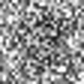 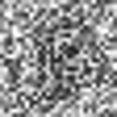 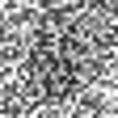

Part of the problem was that writes would be concentrated around a portion (20%) of all the hard locations so that subsequent writes would interfere with earlier ones. To try to alleviate this I calculated the average for each of the labels then imprinted these onto 10% segments of the hard locations. This resulted in an improved **~50% accuracy**. 

_Average per label_

 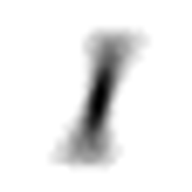 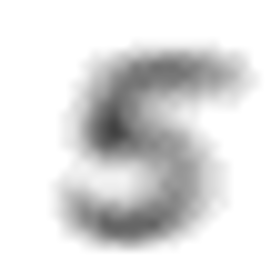

_Hard location addresses imprinted with average 0_

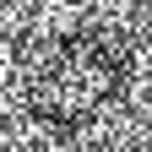 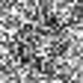 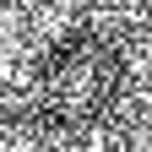

_Hard location addresses imprinted with average 1_

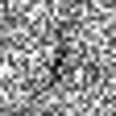 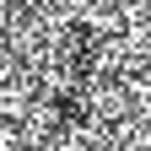 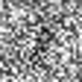

_Hard location addresses imprinted with average 5_

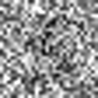 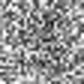 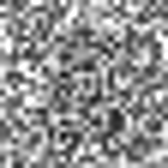

The low accuracy is a direct result of the distribution the hard locations and in the future I want to try out other strategies/algorithms to improve it.

### Source Material
- Kanerva, P. 1988. Sparse Distributed Memory.
- Snaider, J., Franklin, S. Integer Sparse Distributed Memory 
- Snaider, J. 2012. Integer Sparse Distributed Memory and Modular Composite Representation
